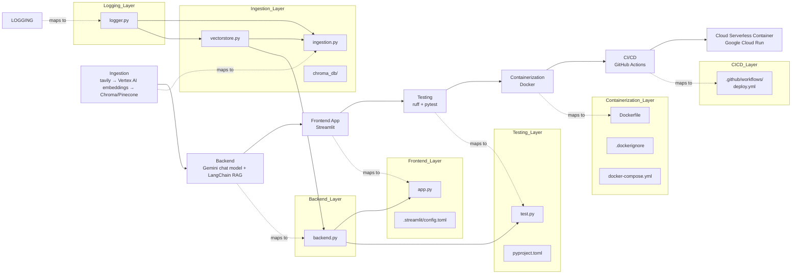
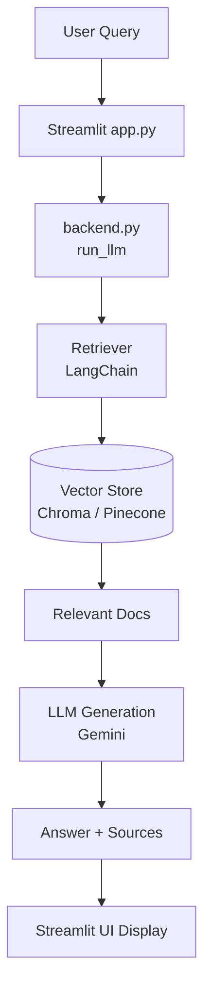

## 🦜🔗 Cloud‑Hosted RAG Pipeline — LangChain + Vertex AI + Cloud Run

<div align="center">

**An end‑to‑end RAG workflow: Ingestion → Retrieval → Streamlit UI → Testing → CI/CD → Cloud Run Hosting**

[](https://www.python.org/)
[](https://tavily.com/)
[](https://cloud.google.com/vertex-ai)
[](https://www.trychroma.com/)
[](https://pinecone.io/)
[](https://ai.google.dev/)
[](https://langchain.com/)
[](https://streamlit.io/)
[](https://docs.astral.sh/ruff/)
[](https://docs.pytest.org/)
[](https://www.docker.com/)
[](https://github.com/features/actions)
[](https://cloud.google.com/run)

</div>

<br>

## 📚 0. Table of Contents
<details>
  <summary><strong>Expand to view contents</strong></summary>
<br>

- [🎯 1. Project Overview](#-1-project-overview)
- [🚀 2. Quick Start \& UI Usage](#-2-quick-start--ui-usage)
  - [2.1 Quick Start (Using the Pre‑built `chroma_db/`)](#21-quick-start-using-the-prebuilt-chroma_db)
  - [2.2 Streamlit UI Usage](#22-streamlit-ui-usage)
  - [2.3 Optional: Try the Cloud‑Hosted Version (If Available)](#23-optional-try-the-cloudhosted-version-if-available)
- [📁 3. Repository Structure](#-3-repository-structure)
- [🏗️ 4. Architecture](#️-4-architecture)
  - [4.1 Project Structure (Modules \& System Flow)](#41-project-structure-modules--system-flow)
  - [4.2 Application Flow (Runtime Interaction)](#42-application-flow-runtime-interaction)
- [🔎 5. Logging](#-5-logging)
- [🔐 6. Service Accounts, Credentials \& Environment Variables](#-6-service-accounts-credentials--environment-variables)
  - [6.1 Service Accounts](#61-service-accounts)
  - [6.2 Credentials \& Environment Variables](#62-credentials--environment-variables)
- [🛠️ 7. Development](#️-7-development)
- [🧪 8. Testing](#-8-testing)
- [☁️ 9. Deployment](#️-9-deployment)
  - [9.1 GitHub Actions CI/CD Pipeline](#91-github-actions-cicd-pipeline)
  - [9.2 Accessing the Deployed Application](#92-accessing-the-deployed-application)
- [🔮 10. Opportunities for Enhancement](#-10-opportunities-for-enhancement)

</details>

<br>

## 🎯 1. Project Overview

The **LangChain Documentation Helper** is a practical, end‑to‑end implementation of a **classical Retrieval‑Augmented Generation (RAG) pipeline**, designed as a *slim, self‑hosted version of* [chat.langchain.com](https://chat.langchain.com/).

It provides source‑grounded answers to questions about the official [LangChain Python documentation](https://docs.langchain.com/oss/python/langchain/overview), delivered through a clean, modular LCEL‑based RAG workflow.

This project focuses on the essential engineering steps behind building and deploying a traditional RAG system. It covers the full lifecycle—from **document ingestion and embedding**, to **vectorstore construction**, to **retrieval‑augmented reasoning**, and finally to a **Streamlit‑based chat interface**. The repository also includes practical operational components such as **logging**, **testing**, **containerization**, and **automated deployment** to **Google Cloud Run**.

The goal is to offer a clear, reproducible reference for engineers who want to understand how a standard LangChain‑based RAG pipeline is developed and delivered in a production‑style environment, without introducing unnecessary complexity or advanced orchestration layers.

### Why this matters for industry

Even as agentic AI and multi‑step orchestration frameworks gain traction, **classical RAG pipelines remain foundational in enterprise GenAI systems**. Organizations continue to rely on solutions that are:

- **Source‑grounded** — ensuring answers are tied to verifiable documentation  
- **Deployable** — packaged in containers and runnable on cloud platforms  
- **Maintainable** — structured with clear modules and predictable behavior  
- **Reproducible** — with ingestion, retrieval, and UI components that can be rebuilt end‑to‑end  

This repository demonstrates these fundamentals in a clean, approachable way.  
It serves as a practical blueprint for teams building their first RAG application, and for engineers seeking to understand the engineering lifecycle behind a deployable, source‑grounded GenAI service.

### Tech Stack

<div align="center">

| Component | Technology | Description |
|-----------|------------|-------------|
| 🐍 **Programming** | Python | Version 3.13 used — AI and full-stack development|
| 🌐 **Web Crawling** | Tavily | Performs targeted web search and documentation retrieval |
| 🧬 **Embeddings** | Vertex AI Embeddings | Generates high‑dimensional vector representations of text |
| 🧊 **Vector Database** | Chroma / Pinecone | Stores and retrieves embeddings for similarity‑based search |
| 🤖 **Chat Model** | Gemini | Produces grounded responses using retrieved context |
| 🧠 **AI Framework** | LangChain | Coordinates ingestion, retrieval, and the RAG pipeline |
| 🖥️ **Frontend UI** | Streamlit | Provides an interactive chat interface for end users |
| 🧪 **Testing** | Ruff, Pytest | Ensures code quality through linting and unit tests |
| 🐳 **Containerization** | Docker | Packages the application into reproducible containers |
| 🔄 **CI/CD** | GitHub Actions | Automates linting, testing, building, and deployment |
| ☁️ **Serverless Hosting** | Cloud Run | Runs the containerized app on a fully managed platform |

</div>

<br>

## 🚀 2. Quick Start & UI Usage

### 2.1 Quick Start (Using the Pre‑built `chroma_db/`)

The fastest way to run the application is to use the **pre‑generated Chroma vectorstore** included in this repository.  
This allows you to launch the Streamlit UI immediately without running the ingestion pipeline.

#### **Step 1 — Clone the repository**

```bash
git clone https://github.com/kpma1120/langchain-rag-e2e.git
cd langchain-rag-e2e
```

The repository already includes:

- `chroma_db/` — a ready‑to‑use vectorstore  
- `docker-compose.yml` — Streamlit + backend containers  
- `.env.example` — environment variable template  

#### **Step 2 — Create a Google Cloud service account**

A Google Cloud service account is required for local development and for authenticating calls to Vertex AI.  
Create the account and download its JSON key, then place it under `credentials/` (e.g., `credentials/service-account.json`).

For a full breakdown of the required roles and the purpose of the custom service account used during local development, see **6.1 Service Accounts**.

#### **Step 3 — Prepare environment variables**

Copy the example environment file:

```bash
cp .env.example .env
```

Then update the path to your Google Cloud service account JSON file in:

```
GOOGLE_APPLICATION_CREDENTIALS=credentials/service-account.json
```

No other environment variables need to be modified at this stage.

#### **Step 4 — Build the Docker images**

```bash
docker compose build
```

This builds:

- the backend RAG service  
- the Streamlit UI  

Both services mount the pre‑built `chroma_db/` folder as a shared volume.

#### **Step 5 — Start the application**

```bash
docker compose up
```

Once the containers start, the Streamlit UI will be available at:

```
http://localhost:8501
```

---

### 2.2 Streamlit UI Usage

<div align="center">
  
  <p><em>Sample query and response displayed in the Streamlit interface</em></p>
</div>

The Streamlit UI provides a simple chat‑based interface for interacting with the LangChain documentation helper.

#### **Chat Input**
At the bottom of the page, you will find the chat box labeled:

```
Ask a question about LangChain…
```

This is where you can enter any query related to the LangChain documentation.

#### **Query Response**
After submitting a query:

- The application retrieves relevant documentation chunks from the vectorstore  
- Generates an answer using the configured LLM  
- Displays both the **answer** and the corresponding **sources**  

The sources section includes metadata such as document titles, URLs, and chunk identifiers, allowing you to trace exactly where the retrieved information came from.

#### **Session Controls**
On the left sidebar, under the **Session** section, there is a **Clear chat** button.  
This resets the Streamlit session state and clears the conversation history, allowing you to start a new query session without refreshing the page.

---

### 2.3 Optional: Try the Cloud‑Hosted Version (If Available)

A Cloud Run–hosted version of this application is also deployed as part of the CI/CD pipeline.  
If the service is currently active, you can access the live Streamlit app here:

**[https://llm-app-668245685616.us-east1.run.app](https://llm-app-668245685616.us-east1.run.app)**

This endpoint allows you to experience the final deployed version without running Docker locally.

> **Note:**  
> This URL may change or become unavailable in the future depending on cloud resource limits and account lifecycle.  
> If the link is inactive, please run the application locally using the steps in **2.1 Quick Start**.

<br>

## 📁 3. Repository Structure
```
langchain-rag-e2e/
├── .github/workflows/       # GitHub Actions CI/CD configuration
│   └── deploy.yml
├── .streamlit/              # Streamlit UI theme configuration
│   └── config.toml
├── chroma_db/               # Pre-generated Chroma vectorstore for quick start
├── screenshots/             # Screenshot images used in README.md
├── .dockerignore            # Files and directories excluded from Docker build context
├── .env.example             # Environment variable template for local development
├── .gitignore               # Git ignore rules for the repository
├── Dockerfile               # Container image definition for the application
├── README.md                # Project documentation
├── app.py                   # Streamlit application entry point
├── backend.py               # Core backend logic (RAG pipeline, retrieval, LLM calls)
├── docker-compose.yml       # Container setup for local development
├── ingestion.py             # Document ingestion and vectorstore building pipeline
├── logger.py                # Custom logging utilities
├── pyproject.toml           # Tooling configuration (Ruff, Pytest, Coverage)
├── requirements-dev.txt     # Development dependencies (full local development and testing environment)
├── requirements-test.txt    # Testing dependencies (especially for lint and test jobs)
├── requirements.txt         # Runtime dependencies for the application
├── test.py                  # Basic test suite for backend logic
└── vectorstore.py           # Vectorstore abstraction layer (Chroma / Pinecone)
```

<br>

## 🏗️ 4. Architecture

### 4.1 Project Structure (Modules & System Flow)

The diagram below illustrates the abstract end‑to‑end pipeline — from ingestion to cloud deployment — together with the concrete Python modules and configs that implement each stage.



### Key idea  
A two‑layer view keeps the architecture both intuitive and implementation‑aligned:  

- **Top layer** shows the conceptual pipeline:  
```
Ingestion → RAG Backend → Frontend → Testing → Containerization → CI/CD → Cloud
```

- **Bottom layer** maps each stage to the actual modules and configs in this repository:  
```
Ingestion: ingestion.py + vectorstore.py (with prebuilt chroma_db/ for quick start)
Backend: backend.py (retrieval + LLM orchestration)
Frontend: app.py + .streamlit/config.toml (Streamlit UI and theme)
Logging: logger.py (cross‑cutting utilities)
Testing: test.py + pyproject.toml (pytest, Ruff, coverage setup)
Containerization: Dockerfile, .dockerignore, docker-compose.yml (local and cloud builds)
CI/CD: .github/workflows/deploy.yml (GitHub Actions pipeline)
Cloud: Google Cloud Run (final runtime environment deployed via gcloud run as defined in deploy.yml)
```

This representation ties the high‑level pipeline directly to its concrete implementation, highlighting how code, configs, and infrastructure work together to deliver the end‑to‑end GenAI RAG system.  

---

### 4.2 Application Flow (Runtime Interaction)

The following diagram shows how a user query flows through the system at runtime, with an emphasis on the relationship between the retriever, vector store, and relevant documents.

<details>
  <summary><strong>Click to expand application flow diagram</strong></summary>


</details>

### Key idea  
The backend orchestrates retrieval and generation:  
- The **Retriever** queries the **Vector Store**  
- The vector store returns **Relevant Docs**  
- The LLM synthesizes an **Answer + Sources**  
- Streamlit renders the final response  

This diagram captures the essential RAG loop in a clean, minimal form.

<br>

## 🔎 5. Logging

The project includes a lightweight, visually expressive logging utility used primarily during ingestion and vectorstore operations. It emphasizes **clarity**, **color‑coded feedback**, and **semantic log levels** to make local development and debugging more intuitive without relying on a full logging framework.

### Log Levels & Visual Styling

Each log function corresponds to a clear semantic level, paired with distinct colors and emojis for quick visual recognition.

| Level | Function | Style | Description |
|-------|----------|--------|-------------|
| **Info** | `log_info()` | Cyan + ℹ️ | General operational messages |
| **Success** | `log_success()` | Green + ✅ | Completed steps or positive outcomes |
| **Warning** | `log_warning()` | Yellow + ⚠️ | Non‑critical issues or soft alerts |
| **Error** | `log_error()` | Red + ❌ | Failures or exceptions |
| **Header** | `log_header()` | Bold purple + 🚀 | Section separators for readability |

All styling is implemented using ANSI escape codes defined in the `Colors` class, ensuring consistent formatting across terminals without external dependencies.

<br>

## 🔐 6. Service Accounts, Credentials & Environment Variables

### 6.1 Service Accounts  

This project uses two Google Cloud service accounts, each serving a distinct purpose across **local development** and **Cloud Run deployment**.  
Separating these accounts ensures clear responsibility boundaries and secure execution in both environments.

#### 1. Custom Service Account  
- **Actual name in this project**: `genai-llmops-repo1@genai-llmops-repo1.iam.gserviceaccount.com`  
- **General format**: `{service_account_name}@{project_id}.iam.gserviceaccount.com`  
- **Purpose**:  
  This account is manually created and used exclusively for **local development**, providing authenticated access to Vertex AI and other GCP resources when running the ingestion pipeline or backend locally.  
  The downloaded JSON key (`credentials/service-account.json`) is referenced through the `GOOGLE_APPLICATION_CREDENTIALS` environment variable.  
- **Permissions**:  
  The account is granted the necessary IAM roles to call Vertex AI APIs and access required GCP services during local runs. These permissions enable embedding generation, LLM calls, and any other GCP‑authenticated operations performed by the ingestion or backend modules.

<div align="center">
  
  <p><em>Custom service account configured with required IAM roles</em></p>
</div>  

#### 2. Default Compute Engine Service Account  
- **Actual name in this project**: `668245685616-compute@developer.gserviceaccount.com`  
- **General format**: `{project_number}-compute@developer.gserviceaccount.com`  
- **Purpose**:  
  This is the automatically generated service account used by **Cloud Run** to execute the deployed container.  
  It authenticates backend calls made from the cloud environment, particularly requests to Vertex AI during RAG inference.  
- **Permissions**:  
  The account is assigned the **Vertex AI User** role (`roles/aiplatform.user`), enabling the Cloud Run service to perform model inference and embedding operations securely at runtime.

<div align="center">
  
  <p><em>Cloud Run service account configured with the required Vertex AI permissions</em></p>
</div>  

---

### 6.2 Credentials & Environment Variables  

Configuration is split between **local development** and **CI/CD deployment**, with sensitive values injected securely at runtime.

#### Local Development  
- Environment variables are loaded from `.env` (see `.env.example`).  
- The file `credentials/service-account.json`—downloaded from the custom service account—is required for local ingestion and backend execution, enabling authenticated access to Vertex AI and other GCP services.  
- This file is used **only locally** and is never committed to the repository.

#### CI/CD Deployment  
- Secrets are injected via **GitHub Actions** in `deploy.yml`.  
- These include the base64‑encoded service account key, project identifiers, and vectorstore configuration values used throughout both the testing workflow and the Cloud Run deployment process.
- No credentials are stored in the repository; all sensitive values are provided dynamically at runtime.

#### Variable Mapping  
| Variable / Secret | Local (.env / credentials) | CI/CD (Secrets) | Purpose |
|-------------------|-----------------------------|-----------------|---------|
| **GOOGLE_APPLICATION_CREDENTIALS** | ✔️ Yes | ❌ No | Path to local Google Cloud service account JSON. |
| **GCP_SA_KEY** | ❌ No | ✔️ Yes | Base64‑encoded Google Cloud service account JSON for CI/CD authentication. |
| **GCP_PROJECT_ID** | ❌ No | ✔️ Yes | Google Cloud project ID for Artifact Registry & Cloud Run. |
| **TAVILY_API_KEY** | ✔️ Yes | ❌ No | Tavily API key for ingestion web crawling. |
| **VECTORSTORE_PROVIDER** | ✔️ Yes | ✔️ Yes | Selects vector store backend: `chroma` or `pinecone`. |
| **PINECONE_API_KEY** | ✔️ Yes | ✔️ Yes | Pinecone API key for vectorstore operations. |
| **PINECONE_INDEX_NAME** | ✔️ Yes | ✔️ Yes | Pinecone index name (only used when provider = pinecone). |
| **CHROMA_PERSIST_DIR** | ✔️ Yes | ✔️ Yes | Directory for ChromaDB persistence (local or CI tests). |

#### Key idea  
Local runs rely on `.env` and a downloaded service account file, while CI/CD pipelines use GitHub Secrets to inject credentials securely. This separation ensures reproducibility for developers and safe automation for deployment.

<br>

## 🛠️ 7. Development

Local development follows a simple setup flow: create a Python environment, configure credentials, prepare environment variables, and run the ingestion + application components.

1. **Create a Python 3.13 virtual environment**  
   Use either `venv` or `conda` to create a virtual environment for `python 3.13.*`, then install development dependencies:  
   ```
   pip install -r requirements-dev.txt
   ```

2. **Create a Google Cloud service account**  
   Assign the required IAM roles, generate a JSON key, and place it under `credentials/`  
   (same as Step 2 in 2.1 Quick Start).

3. **Configure environment variables**  
   Copy `.env.example` → `.env` and fill in all parameters, especially choose which vectorstore you want via
   `VECTORSTORE_PROVIDER` (`chroma` or `pinecone`).

4. **Run the ingestion pipeline**
   Execute the ingestion script to load documents, generate embeddings, and build the vector store:
   ```
   python ingestion.py
   ```
   Once the pipeline completes, you should see color‑coded logs indicating each step of the process and a final success message, similar to the example below.
   <div align="center">
     
     <p><em>Example console output from a successful ingestion run</em></p>
   </div>

5. **(Optional) Test backend logic**  
   ```
   python backend.py
   ```
   This verifies that `run_llm()` and vectorstore retrieval work as expected.

6. **Start the Streamlit application**  
   ```
   streamlit run app.py
   ```
   Visit `http://localhost:8501` to interact with the local UI.

This workflow provides a complete local environment for ingestion, retrieval, and UI testing with minimal setup.

<br>

## 🧪 8. Testing

Local testing is configured through `pyproject.toml` and a single test module `test.py`.  
The setup covers linting, unit testing, and coverage reporting, matching the same workflow used in CI/CD.

### Local Test Configuration  
- **Ruff** is configured in `pyproject.toml` for linting (PEP8, imports, upgrades, bugbear).  
- **Pytest** is configured with verbose output, coverage reporting, and automatic export of results to `test-results/junit.xml`.  
- **test.py** uses fixtures and monkeypatching to mock the RAG pipeline (`rag_chain`, `refine_chain`, `retriever`) and validate `run_llm()` behavior under different scenarios.

### Running Tests Locally  
Linting and unit tests can be executed directly from the command line:

```
ruff check .
pytest
```

### Test Outputs  
Running pytest produces two key outputs:

- **Console output** — immediate pass/fail results with coverage summary  
- **JUnit XML report** — exported automatically to `test-results/junit.xml` for CI integration

### CI/CD Integration  
The same lint and test steps run automatically in GitHub Actions, ensuring consistent validation across local and cloud environments. Further details are covered in the Deployment section.

<br>

## ☁️ 9. Deployment

### 9.1 GitHub Actions CI/CD Pipeline

Automated deployment is handled by **GitHub Actions** through the workflow file `deploy.yml`.  
The pipeline consists of three sequential jobs that validate code quality, run tests, and deploy the latest version of the application to **Google Cloud Run**:

- **lint** — executes Ruff checks for code quality  
- **test** — runs pytest with coverage and uploads `test-results/junit.xml` as an artifact  
- **build-and-deploy** — builds the Docker image, pushes it to Artifact Registry, and deploys the updated container to Cloud Run  

<div align="center">
  
  <p><em>Successful GitHub Actions CI/CD pipeline run</em></p>
</div>

The **test-results** artifact can be downloaded directly from the workflow run for inspection.

Cloud Run requires appropriate permissions to invoke Vertex AI during inference.  
These permissions are granted to the **default Compute Engine service account**, as described in **6.1 Service Accounts**, ensuring that the deployed container can securely perform embedding generation and LLM calls at runtime.

After deployment, Cloud Run hosts the latest version of the application:

<div align="center">
  
  <p><em>Successfully deployed Cloud Run service</em></p>
</div>

---

### 9.2 Accessing the Deployed Application

After deployment, Cloud Run exposes a public URL in the format:

```
https://{service-name}-{project-number}.{region}.run.app
```

For this project, the deployed service is available at:

```
https://llm-app-668245685616.us-east1.run.app
```

Open the URL to confirm the Streamlit application is running successfully.  
This completes the full cloud‑hosted RAG pipeline:  
**Ingestion → RAG backend → Streamlit UI → Testing → CI/CD → Cloud Run**

<br>

## 🔮 10. Opportunities for Enhancement

Potential enhancements highlight ways to strengthen observability, developer experience, and the overall robustness of the end‑to‑end RAG pipeline.

- **End‑to‑End Tracing & Observability (`LangSmith` / `LangFuse` / `OpenTelemetry`)**  
  Strengthen the system’s observability by adding a unified tracing layer that captures ingestion steps, retrieval behavior, LLM calls, and final outputs. This can be achieved by integrating tools such as **LangSmith**, **LangFuse**, or **OpenTelemetry** to provide structured traces and request‑level visibility. Enhanced tracing would make it easier to diagnose bottlenecks, assess retrieval quality, and ensure the overall reliability of the end‑to‑end RAG workflow.

- **Enhanced Monitoring & Drift Detection (`Evidently AI` / `Phoenix` / `WhyLabs` / `OpenTelemetry`)**  
  Strengthen the monitoring layer by incorporating tools such as **Evidently AI**, **Arize Phoenix**, **WhyLabs**, or **OpenTelemetry**‑based metrics to track data drift, embedding drift, and model‑level behavior. These monitoring capabilities would complement the existing logging setup with structured reports and anomaly detection, making it easier to identify degradation in retrieval quality or shifts in the underlying data distribution over time.

- **Improved Retrieval Transparency**  
  Extend the current “sources only” display by surfacing short context snippets alongside each cited document in the Streamlit UI. Showing the exact text chunks that were retrieved—and used to ground the answer—would make the RAG behavior more interpretable for users and provide a clearer basis for evaluating whether the retrieved context is appropriate and sufficient.

- **Structured Logging with `loguru` + `structlog`**  
  Replace the lightweight ANSI‑styled logger with a structured logging stack — **loguru** and **structlog** to support richer context, JSON output, and easier downstream analysis. This would improve debuggability during ingestion and retrieval, and make logs more suitable for centralized log aggregation in cloud environments.
